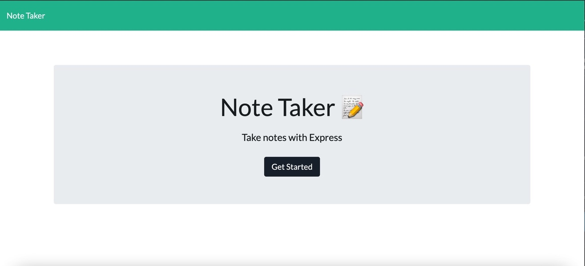
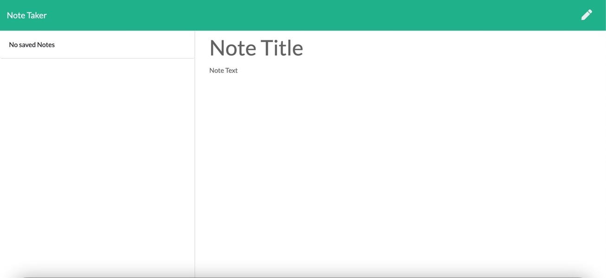

# Note_Taker  
This is a note taker app utilizing express on the backend to save and retrieve the note data from a JSON file. It uses an already created front end and has been deployed to Heroku.
## Table of Contents:
* [Installation](#installation)
* [Usage](#usage)
* [License](#license)
* [Contributing](#contributing)
* [Tests](#tests)
* [Questions](#questions)
### Installation:
In order to install the necessary dependencies, open the console and run the following:
```npm install```
### Usage:
It's fun
### License:
This project is licensed under:
MIT
### Contributing:
No contributions
### Tests:
In order to test open the console and run the following:
```npm test```
### Questions:
If you have any questions contact me on [GitHub](https://github.com/rroman6292) or contact 
 at 






    
 
